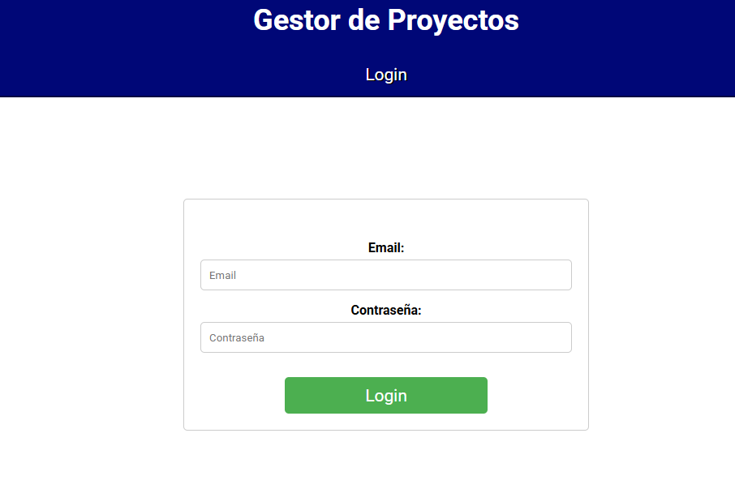
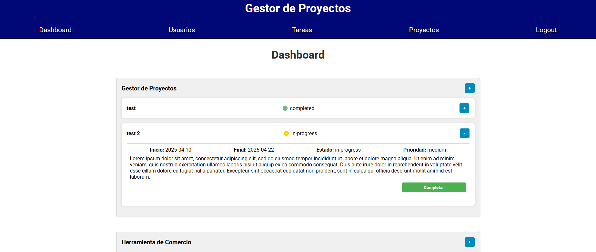
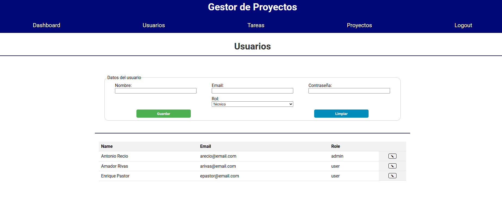
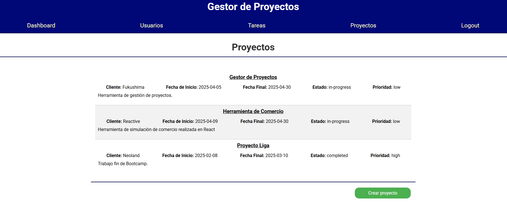
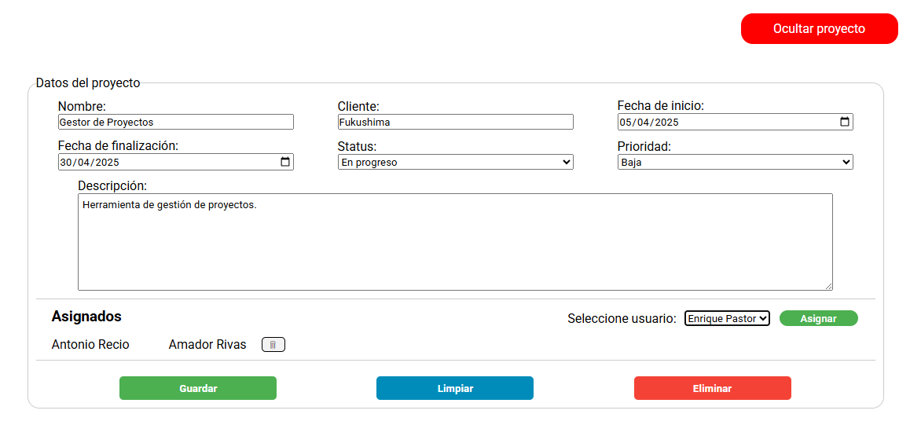
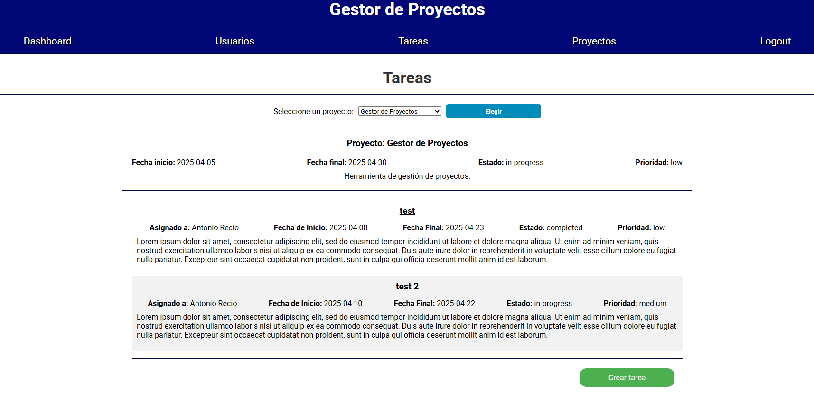
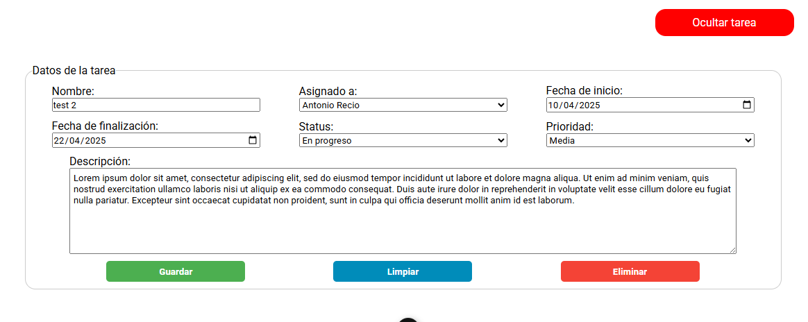

# Gestor de Proyectos

Repositorio de José Ramón Carralero, proyecto propio, herramienta de gestión de proyectos.

## Descripción

La herramienta consiste en una web para la visualización y gestión de proyectos y sus tareas, además de una pequeña gestión de usuarios. Es una aplicación realizada para pc, aunque tiene estilos responsive, no está adaptado para dispositivos móviles.

Actualmente consta de dos tipos de perfiles, administrador y usuario.

Lo primero que encontramos al acceder a la aplicación es la página de Login.



Tras hacer login en la aplicación, se redirigirá al usuario al dashboard.



Esta es la pantalla principal de la herramienta y la única a la que puede acceder el perfil usuario, que consta de:

* Listado de los proyectos a los que esta asignado el usuario, con la opción de ver u ocultar su detalle
* Dentro de cada proyecto, se muestra un listado de las tareas de dicho proyecto que están asignadas al usuario, con la opcion de ver u ocultar su detalle
* Estas tareas, si están como pendientes puedes aceptarlas, y si esta en progreso puedes completarlas.

Las siguientes opciones estan disponibles para el perfil administrador.

Gestion de usuarios:



* Formulario para la creación, edición y borrado de usuarios.
* Listado de todos los usuarios.

Gestion de proyectos:

* Listado de todos los proyectos.

* Formulario para la creación, edición y borrado de proyectos. El creador del proyecto se añade directamente como asignado, y el selector de usuarios asignados muestra todos los usuarios menos lo ya asignados. Estos se pueden desasignar excepto el creador.


Gestion de tareas:

* Selector de proyectos para filtrar las tareas.
* Listado de todas las tareas de ese proyecto.

* Formulario para la creación, edición y borrado de tareas. Sólo se pueden crear tareas en proyectos existentes y habiendo un proyecto elegido


## Tecnologías usadas

Para el frontend usamos VueJs, para el backend NodeJs y ExpressJs, y para la base de datos MongoDB.

## Funcionamiento

Para la gestión del usuario y el login usamos Firebase. En el login se hace la comprobación en Firebase y devuelve el token de usuario, el cual es mandado al backend, donde se verifica el token y se accede a la base de datos para obtener la información del usuario. La configuración de Firebase no está incluida en el repositorio de git.

Esta información del usuario la devolvemos al frontend, y será gestionada por Pinia. El acceso a las distintas rutas se realiza mediante el uso de vue-router, comprobando el perfil del usuario que tenemos en la store de Pinia para comprobar si puede acceder a la ruta. En caso de no poder acceder se redirige al login. La barra de navegación mostrará solo las rutas disponibles para el perfil del usuario.

Para la gestión de los distintos elementos, al hacer la petición fetch al servidor, obtenemos un token que se añadirá a la cabecera de la petición. En el servidor, se verifica el token y se comprueba si el usuario puede realizar la petición por medio de un middleware.

Las peticiones devuelven un JSON con el status, un mensaje con la información sobre el resultado de la petición (si ha ido correcto es un OK, en caso contrario muestra el error) y el cuerpo de la petición. En el frontend comprueba este mensaje para mostrar el mensaje de error si fuera necesario.

## Instalación y ejecución

```bash
npm install
```

Ejecutar en el terminal el servidor del backend.

```bash
npm run server:express:start
```

Ejecutar en otro terminal el servidor de front de VueJS.

```bash
npm run dev
```

La configuración de los puertos está definida en el archivo .env, no incluído en el repositorio de git.
